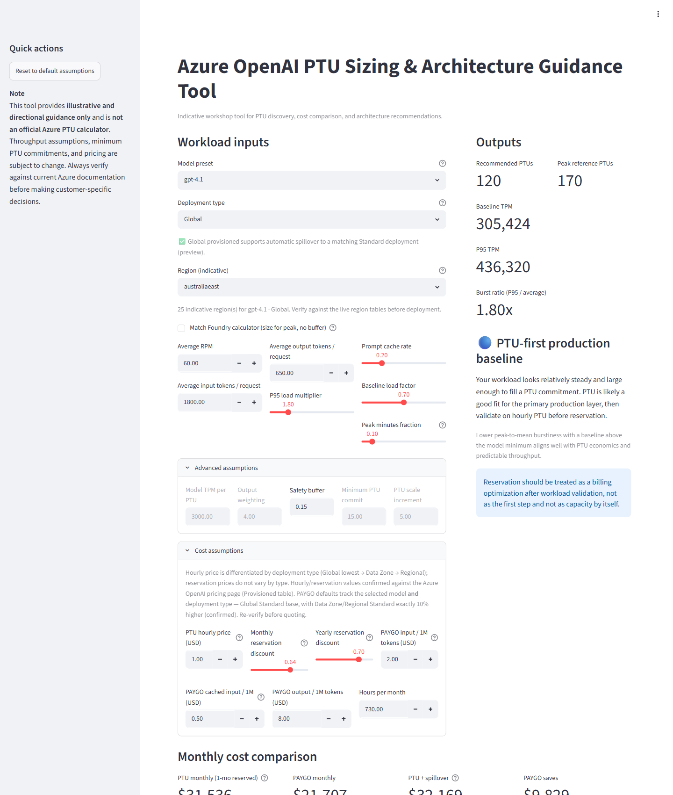
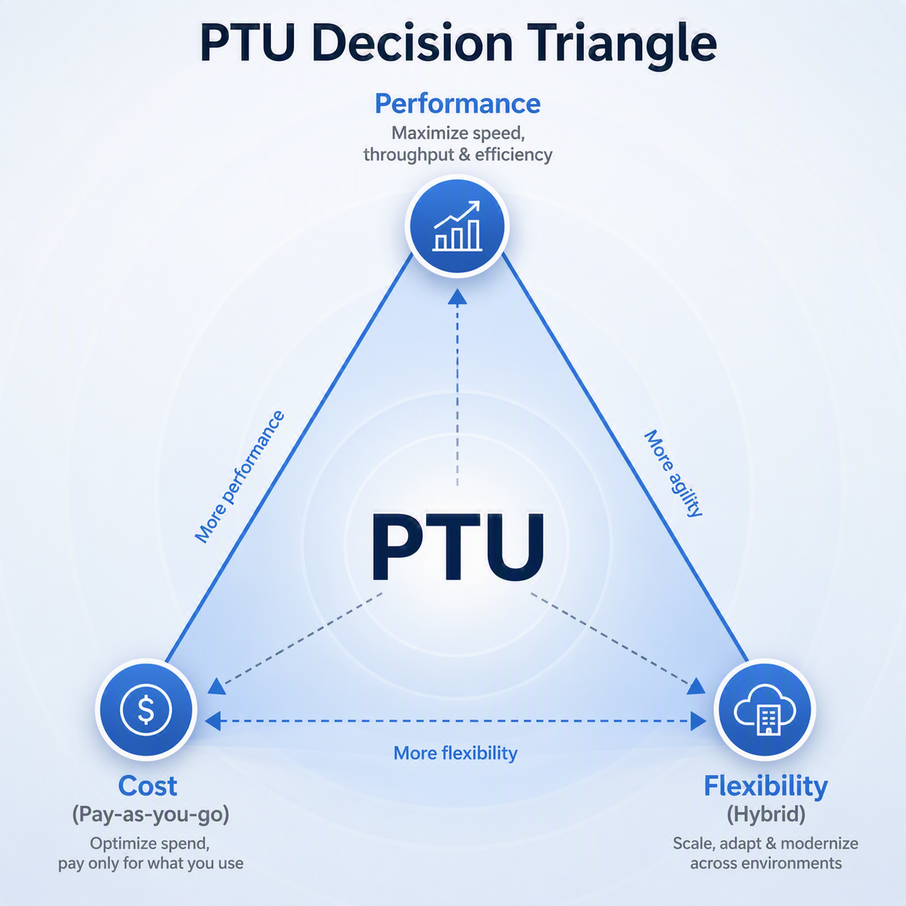
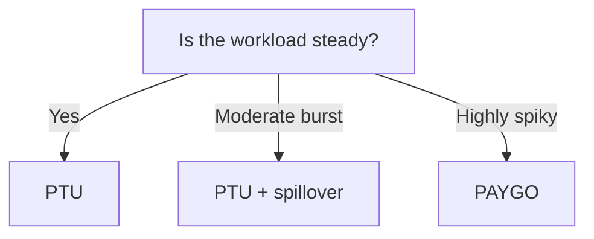
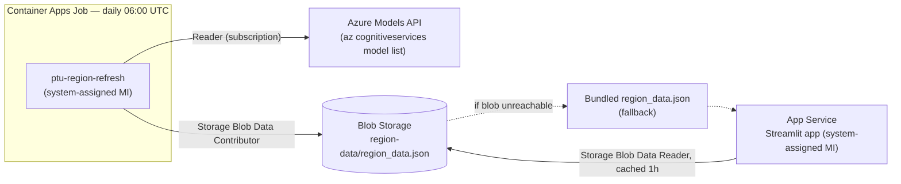

# Azure OpenAI PTU Sizing Tool

*…with architecture guidance.*

<!-- CI status for the published repo. -->
[](https://github.com/lindazhang2000/azure-openai-ptu-sizing-tool/actions/workflows/ci.yml)
[](LICENSE)

> ⭐ If this helps you, please star the repo and share with your team.

> 👉 **Bottom line:** PTU is not a pricing decision — it's an architecture decision.

An interactive **PTU sizing tool** for **Azure OpenAI Provisioned Throughput Units (PTU)** — a Streamlit app plus a Jupyter notebook that estimate baseline PTU needs, compare PTU vs PAYGO cost, and recommend an architecture pattern.

*Based on real customer architecture patterns observed across production workloads.*

Most teams get PTU wrong — not because of sizing,
but because they start with the wrong question.

This tool solves that problem:

👉 NOT "how many PTUs"
👉 but "whether you should even use PTU at all"

It helps you:

- Decide **PTU vs PAYGO vs Hybrid**
- Avoid over-provisioning
- Align cost with workload behavior (not guesswork)

> 💡 **Key principle:**\
> PTU should be sized for steady-state **baseline** — not peak demand.
>
> Use PAYGO (or Standard) for spikes.



> **Disclaimer:**\
> This tool provides directional guidance only and is not an official Azure calculator.
> Throughput, pricing, and limits may change. Always validate with Microsoft documentation before making production decisions.
>
> **Recommended usage:** Use this tool to support **architecture discussions and initial sizing exploration**. Always validate results with the official Azure OpenAI / Microsoft Foundry PTU calculator and current pricing before any production deployment, reservation, or capacity commitment.

## 🚀 Start here (2 minutes)

1. Enter:
   - RPM
   - Tokens
   - Burst (P95)

2. Review:
   - Architecture recommendation
   - Baseline PTU

3. Use it to:
   - Drive architecture discussion
   - NOT finalize pricing

👉 Always validate final numbers with the official Azure PTU calculator

## Who this is for

Solution engineers, architects, and customers evaluating **PTU vs PAYGO** for production AI workloads.

## ⚠️ When NOT to use this tool

Avoid using this tool for:

- Final capacity commitments
- Pricing quotes to customers
- SLA or performance guarantees

Use it for:

- ✅ Early architecture decisions
- ✅ PTU vs PAYGO discussions
- ✅ Customer education

## What this tool helps decide

From a few workload inputs, it answers the three questions that drive an Azure OpenAI capacity decision:

- **PTU or PAYGO?** — which model better balances cost, predictability, and performance for your traffic.
- **How many PTUs?** — the baseline to provision, rounded to what you can actually deploy.
- **Which architecture?** — PTU-first, PTU + Standard spillover, or PAYGO/pilot, based on burstiness.

Everything below the next two sections is reference depth — read it when you need the formulas, assumptions, and worked scenarios.

## 📈 Business impact

Using this tool helps:

- Reduce over-provisioning risk
- Accelerate PTU adoption decisions
- Improve architecture consistency across teams
- Enable faster customer conversations

→ Leads to better capacity planning and workload alignment

## Why this vs the official Azure PTU calculator

The two are **complementary, not competing**. Microsoft's calculator is the authoritative source for throughput, minimums, and pricing — always validate final numbers there. This tool focuses on the **architecture decision that comes *before* sizing**:

| | This tool | Official Azure PTU calculator |
| --- | --- | --- |
| **Primary output** | An architecture *recommendation* (PTU-first / PTU + spillover / PAYGO) | A PTU *quantity* |
| **PTU vs PAYGO cost** | Side-by-side comparison with break-even made explicit | Not the focus |
| **Burstiness** | Models steady baseline vs peak (P95 multiplier + baseline load factor) so you size to baseline, not peak | Sizes to the throughput you enter |
| **Spillover** | Flags feasibility by deployment type (Global/Data Zone vs Regional) | Not addressed |
| **Reservations** | 1-month / 1-year discount folded into the cost story | Not addressed |
| **Transparency** | Open-source formulas, editable assumptions, notebook | Hosted, fixed logic |
| **Pricing/throughput authority** | Directional — verify before quoting | ✅ Authoritative and current |

**Use this** to decide the pattern and frame PTU-vs-PAYGO in early architecture conversations; **use Microsoft's** to lock the final, quotable numbers.

## The PTU decision triangle

Every PTU decision trades off three forces. PTU sits in the middle — you lean toward whichever corner the workload demands:



| Corner | What it optimizes for | How it maps to this tool |
| --- | --- | --- |
| **Performance** | Speed, throughput, predictable latency under load | Drives the PTU-first recommendation for steady, latency-sensitive workloads. |
| **Cost (PAYGO)** | Pay only for what you use, no commitment | The PTU-vs-PAYGO comparison and the PAYGO recommendation for spiky/low-baseline traffic. |
| **Flexibility (Hybrid)** | Scale and adapt across environments | The PTU + spillover pattern: a committed baseline plus elastic Standard overflow. |

## When to use PTU vs PAYGO

The core decision this tool informs — pick the row that matches the workload's **burstiness** (peak ÷ average load):

| Workload pattern | Recommendation | Why |
| --- | --- | --- |
| **Steady, predictable** (production chatbots, batch) | 🔵 **PTU** | Runs dedicated capacity near full utilization, with guaranteed latency and throughput. |
| **Moderate burst** (RAG, copilots, agents) | 🟢 **PTU + spillover** | Size PTUs to the baseline and let a paired Standard deployment absorb peaks. |
| **Spiky, low baseline** (pilots, internal tools, dev/test) | 🟠 **PAYGO** | A committed PTU deployment would sit idle; usage-based billing is cheaper and simpler. |

> **Rule of thumb:** burst ratio below 2 → PTU; 2–4 → PTU + spillover; 4+ (or a baseline below the model's minimum PTU commit) → PAYGO. PTU is justified by **predictable latency, throughput, and burst protection** — not always by raw cost. See [Example scenarios to try](#example-scenarios-to-try) for worked numbers.

### PTU decision flow



## Repository layout

| Path | Contents |
| --- | --- |
| [app/](app) | The PTU sizing tool. `ptu_core.py` (sizing engine), `ptu_streamlit_app.py` (Streamlit UI), `PTU_Sizing_Notebook.ipynb` (notebook), `test_ptu_core.py` (tests), the bundled `region_data.json` snapshot, plus the app `README.md` and `requirements.txt`. |
| [scripts/](scripts) | Operations and demo tooling. `deploy-appservice.ps1` (App Service deploy), `refresh_regions.py` + `region-refresh-job.yaml` (regenerate region availability via the Azure Models API / daily Container Apps Job), `token_usage.py` (per-deployment / per-model token usage across a subscription, with a `--demo` synthetic mode), `usage_to_sizing.py` (optional bridge that turns observed usage into sizing-tool inputs), `demo_play.ps1` / `demo_play.sh` (self-running narrated demo playback; add `-Short`/`--short` for a teaser), and `test_token_usage.py` / `test_usage_to_sizing.py` (tests). |
| [docs/](docs) | Supporting assets: `app-screenshot.png`, `PTU_decision_triangle.png`, and `demo-script.md` (timed demo narration / recording guide). |
| [linkedin/](linkedin) | `ptu_post.md` — a ready-to-share LinkedIn post about the tool. |
| Root | `README.md`, `requirements.txt` (deploy/runtime deps for App Service; the `app/` copy adds `pytest` for local dev + tests), `pyproject.toml` (packaging + pytest config), and `LICENSE` / `CODE_OF_CONDUCT.md` / `CONTRIBUTING.md` / `SECURITY.md`. |

## Running the tool

From the [app/](app) folder:

### Streamlit app

```bash
pip install -r requirements.txt
streamlit run ptu_streamlit_app.py
```

### Jupyter notebook

```bash
pip install -r requirements.txt
jupyter notebook PTU_Sizing_Notebook.ipynb
```

## Deploying to Azure App Service

A reusable PowerShell script packages the app and deploys it to a Linux Python
App Service via Oryx build. Requires an active `az login` session and the Azure CLI.

```powershell
# Redeploy current code to the existing App Service
./scripts/deploy-appservice.ps1

# Create a new Free-tier (F1) App Service, then deploy
./scripts/deploy-appservice.ps1 -Provision -AppName <globally-unique-name>
```

Run it from the repository root. See the script header for all parameters
(`-ResourceGroup`, `-AppName`, `-PlanName`, `-Location`, `-Provision`).

## Region data refresh architecture

The **Region** dropdown is backed by `region_data.json`, which is kept current
automatically — no redeploy needed. A scheduled **Azure Container Apps Job**
regenerates the data daily and publishes it to **Blob Storage**, and the app reads
it at runtime. All access is **Microsoft Entra ID (managed identity)** — the storage
account disables shared-key and public access, so no secrets or SAS are involved.



| Concern | Detail |
| --- | --- |
| **Schedule** | Daily at 06:00 UTC (cron `0 6 * * *`), defined in [scripts/region-refresh-job.yaml](scripts/region-refresh-job.yaml). |
| **Write path** | The job authenticates with its managed identity, runs [scripts/refresh_regions.py](scripts/refresh_regions.py), and uploads the result to the `region-data` container. |
| **Read path** | The app fetches the blob via `DefaultAzureCredential` when the `REGION_DATA_BLOB_URL` app setting is present (cached one hour), falling back to the snapshot bundled in `app/`. |
| **Auth** | Entra ID / managed identity only. Job MI needs **Reader** (subscription) + **Storage Blob Data Contributor**; app MI needs **Storage Blob Data Reader**. |

Update or trigger the job on demand:

```bash
az containerapp job update -n ptu-region-refresh -g ptu-sizing-rg --yaml scripts/region-refresh-job.yaml
az containerapp job start  -n ptu-region-refresh -g ptu-sizing-rg
```

## Token usage reporting

[scripts/token_usage.py](scripts/token_usage.py) is an ops helper that pulls actual
token consumption from **Azure Monitor** for every Azure OpenAI / AI Services account
in a subscription, broken down **per deployment** and **per model**. It needs Azure
credentials (`az login`) and at least **Monitoring Reader** (or Reader) on the accounts.

```bash
az login
python scripts/token_usage.py                      # last 30 days, hourly peaks
python scripts/token_usage.py --days 7             # last 7 days
python scripts/token_usage.py --interval PT5M      # finer peak resolution
python scripts/token_usage.py --ptu-hint           # suggest a baseline PTU per peak
python scripts/token_usage.py --json usage.json --csv usage.csv
python scripts/token_usage.py --demo               # synthetic data, no Azure needed
```

> **Try it with no Azure account — `--demo`.** Pass `--demo` to run against built-in
> synthetic workloads (two pretend accounts, four deployments) instead of querying
> Azure. No credentials, no live data exposed, and the numbers are deterministic — it
> combines all the features (per-model concurrent peak, the `PT1H` vs `PT5M`
> granularity story, `--ptu-hint`, `--json`/`--csv`) so it is ideal for demos,
> screenshots, and recordings. See [docs/demo-script.md](docs/demo-script.md).


Azure Monitor retains platform metrics for **~93 days**; if the requested range
reaches further back the script warns that older data will be missing (peaks would
be under-counted). Pass `--clamp` to pull the start forward to the retention cutoff
instead.

It prints two sections: **Token usage** (totals for the period) and **Peak demand**
(the busiest single time bucket per deployment, account, and the whole subscription,
with a tokens/min rate and timestamp). When a model is spread across several
deployments, a per-model *concurrent* peak is shown too. Add `--ptu-hint` to map each
deployment's observed peak to a directional baseline-PTU suggestion using the same
sizing logic as the app (output tokens weighted per model; `*generic` means no model
preset matched, so defaults were used).

> **Interval trade-off — pick a fine `--interval` when sizing PTUs.** Peak demand is
> only as sharp as the bucket it's measured in. A burst that reads as `~487/min` at
> `PT1H` can be `~3,150/min` at `PT5M` — roughly 6× higher — because the hourly bucket
> averages the spike away. Size PTU capacity against the **fine-grained peak
> tokens/min**, not the period average, or you will under-provision for real bursts.

### Optional: auto-fill the sizing inputs from observed usage

[scripts/usage_to_sizing.py](scripts/usage_to_sizing.py) is a **standalone, optional**
bridge — it is deliberately *not* wired into the app — that turns a usage report into
the workload inputs the sizing tool expects, so you can start from real traffic
instead of typing numbers. It derives the average and peak throughput and the burst
ratio per deployment, matches the model preset, and (with `--calculate`) runs the same
`ptu_core` logic the app uses.

```bash
python scripts/usage_to_sizing.py --demo --calculate          # synthetic, no Azure
python scripts/usage_to_sizing.py --from-json usage.json --calculate
python scripts/usage_to_sizing.py --from-json usage.json --out-json sizing-inputs.json
```

Azure Monitor's token metrics don't expose request counts, so the *average
tokens/min* is what's grounded in real data; `--avg-rpm` is only a nominal divisor
used to express that as "requests × per-request tokens" and does **not** change the
recommended PTU. Treat the output as a directional starting point and validate it in
the app / official Azure PTU calculator before committing capacity.

## What the tool does

Given workload inputs (average RPM, input/output tokens per request, P95 multiplier, prompt cache rate, etc.) and cost assumptions, the tool:

1. Estimates a steady-state **baseline PTU** recommendation and a **peak reference PTU** figure.
2. Compares **PTU vs PAYGO** monthly cost.
3. Suggests an architecture pattern based on burstiness (PTU-first, PTU + Standard spillover, or PAYGO / smaller PTU pilot). Automatic spillover is only offered on Global and Data Zone deployments, so a Regional deployment with a bursty profile is flagged for *manual overflow* instead.

The guiding principle: size PTU for the steady-state baseline, use Standard/PAYGO for spillover, and treat reservation as a billing optimization **after** workload validation — not as the first step.

## Example scenarios to try

Type these into the **Workload inputs** (the `→` row is calculated for reference, not an input); leave the Advanced and Cost assumptions at their defaults. The architecture recommendation is driven by the **P95 load multiplier** — it expresses your peak versus average load, matching the **peak requests/minute ÷ average requests/minute** ratio used by Microsoft's PTU calculator. Because request size is constant, scaling peak requests/minute scales peak token throughput by the same factor, so the multiplier *is* the burst ratio (e.g. `2.8` = peaks run 2.8x the average).

| Input | A — Customer service chatbot (24/7, predictable traffic) | B — Internal copilot / RAG app (morning & meeting spikes) | C — Pilot / internal tool (occasional spikes, low baseline) |
| --- | --- | --- | --- |
| Average RPM | 30 | 120 | 15 |
| Avg input tokens / request | 1200 | 2500 | 900 |
| Avg output tokens / request | 400 | 800 | 300 |
| P95 load multiplier = burst ratio | 1.5 | 2.8 | 4.5 |
| **→ Peak RPM (derived: avg RPM × multiplier)** | **45** | **336** | **67.5** |
| Prompt cache rate | 0.30 | 0.20 | 0.10 |
| Baseline load factor | 0.70 | 0.70 | 0.70 |

What you should see:

- **A** → 🔵 *PTU-first production baseline* (burst 1.50x), recommended PTUs rounded up to the model scale increment (multiples of 5 for OpenAI models).
  - **Why:** the burst ratio is below 2, so traffic is predictable and a dedicated PTU deployment runs near full utilization with stable latency. **Next:** provision the recommended PTUs on Global, lock the ~64% discount with a 1-month reservation, and watch utilization for a few weeks before committing to a 1-year term.
- **B** → 🟢 *PTU + Standard spillover* (burst 2.80x), several hundred PTUs — the recommendation is driven by **burstiness**, not raw cost (with confirmed gpt-4.1-class PAYGO rates the dedicated PTU baseline can cost more than pure PAYGO at this volume; PTU buys predictable capacity, latency, and burst protection).
  - **Why:** a 2–4x burst means a peak-sized PTU deployment would sit idle most of the time, so size PTUs to the baseline and let Standard absorb the spikes. **Next:** deploy the baseline PTUs on Global or Data Zone (spillover-capable), attach a matching Standard deployment for overflow, and load-test to confirm spillover behaves under peak.
- **C** → 🟠 *PAYGO or smaller PTU pilot* (burst 4.50x), small PTU count near the minimum.
  - **Why:** with a 4x+ burst (or a baseline below the model minimum) a committed PTU deployment would sit mostly idle and cost more than usage-based billing. **Next:** start on PAYGO (Standard), instrument real traffic, and only revisit PTU once the sustained baseline grows past the model minimum.

To flip the recommendation, keep everything else fixed and move just the **P95 multiplier**: below 2 = PTU-first, 2–4 = spillover, 4+ = PAYGO. The recommendation also turns to *PAYGO / pilot* whenever the steady baseline needs fewer PTUs than the model minimum (e.g. set **Average RPM** to `1`), since a dedicated PTU deployment would sit idle.

### Regional vs. Global: how deployment type changes the cost story

Take **one** steady workload and change **only the Deployment type** to see why Global is the default and Regional is a data-residency premium. Use `gpt-4.1`, Average RPM `60`, 1800 input / 650 output tokens, P95 `1.8`, cache `0.20`, and leave everything else at defaults. The same workload needs ~120 PTUs of throughput, but the deployment type changes the minimum commit and the hourly price — and therefore the committed cost:

| Deployment type | Min / increment | Recommended PTUs | Hourly $/PTU | PTU monthly (1-mo reserved) | PAYGO monthly | Cheaper option |
| --- | --- | --- | --- | --- | --- | --- |
| Global | 15 / 5 | 120 | $1.00 | ~$31,500 | ~$21,700 | PAYGO |
| Data Zone | 15 / 5 | 120 | $1.10 | ~$34,700 | ~$23,900 | PAYGO |
| Regional | 50 / 50 | 150 | $2.00 | ~$78,800 | ~$23,900 | PAYGO |

Two effects make Regional the most expensive: the larger **minimum / increment** rounds the 120-PTU need up to **150 PTUs**, and the **hourly price doubles** — together pushing the committed cost to **~2.5× Global** for identical traffic. The **PAYGO column also steps up** with the deployment type — Data Zone and Regional Standard token rates are exactly **10% higher** than Global (~$21,700 → ~$23,900) — but it stays well below the committed PTU cost and remains the breakeven reference.

Note the recommendation is **burst-driven, not a pure cost minimizer**: at 60 RPM with confirmed gpt-4.1 PAYGO rates ($2 in / $8 out), pay-as-you-go is actually cheaper than *any* PTU commit, so PTU here is justified by predictable latency/throughput and burst protection rather than raw cost. PTU economics improve for steadier, higher-volume traffic and for pricier models. Across all of that, the deployment-type ordering is constant: **Global is cheapest with the broadest region coverage; Data Zone is a 10% premium for EU/US data-zone routing; Regional is the costly last resort** you pick only when data residency mandates it (and recall Regional has **no automatic spillover**).

## Top PTU mistakes this tool prevents

A handful of sizing mistakes come up again and again. The biggest ones are exactly what this tool is built to catch:

- **Sizing to peak instead of baseline** — it sizes PTUs to the steady baseline and shows peak as a *separate* reference, so you don't buy dedicated capacity for spikes.
- **Ignoring burstiness** — the burst ratio (P95 ÷ average) drives the recommendation, surfacing spiky workloads that belong on spillover or PAYGO.
- **Choosing PTU purely on cost** — the PTU-vs-PAYGO comparison makes it explicit when PAYGO is cheaper, so PTU is positioned for *predictability*, not just price.
- **Overcommitting upfront** — the headline cost uses the 1-month reservation, and the guidance is **start hourly → validate → then reserve**.
- **Using Regional unnecessarily** — the deployment-type comparison exposes Regional's higher minimum and double hourly price, so it's reserved for genuine data-residency needs.

### Top 10 PTU mistakes (customer leave-behind)

> 🔥 **Most reused section (customer leave-behind)**

Avoid these to get predictable performance, cost control, and confident scale:

| # | Mistake | Reality | Fix |
| --- | --- | --- | --- |
| 1 | Sizing on the average and ignoring peaks | P95/P99 reveal the burst behavior the average hides | Use P95/P99 to understand peak behavior, but size PTU to the steady-state baseline (let spillover/PAYGO absorb the rest) |
| 2 | Buying a reservation too early | Reservations are a **billing layer**, not capacity | Start hourly → validate → then reserve |
| 3 | Ignoring routing & spillover | PTU needs a PAYGO spillover / routing layer for bursts | Design for PTU baseline + burst overflow |
| 4 | Mixing unrelated workloads | Different workloads = different latency + token patterns | Segment or prioritize via routing / APIM |
| 5 | Wrong model assumptions | Throughput varies by model + token shape + latency target | Size per model and use real telemetry |
| 6 | Over-sizing for every spike | PTU is **steady-state baseline**, not spike coverage | Use PAYGO for spikes, PTU for core load |
| 7 | Misunderstanding the SLA | PTU SLA covers **model processing only**, not end-to-end latency | Separate backend SLA from app latency (network, orchestration) |
| 8 | No real telemetry before sizing | Sizing depends on RPM, TPM, token ratios, caching | Collect at least 1–2 weeks of workload data |
| 9 | Ignoring architecture (APIM / multi-region) | Routing, resiliency, and allocation need a platform layer | Design the full architecture, not just the model deployment |
| 10 | Treating PTU as cost optimization first | PTU is for predictability, latency stability, production scale | Position PTU as performance + reliability, not just cost |

**Takeaway:** PTU = baseline capacity for predictable workloads · PAYGO = elasticity layer for spikes · success = right sizing + routing + a validation loop.

## Understanding the inputs

### Model preset

- **Model preset** — selecting a model (`gpt-5.2`, `gpt-5.1`, `gpt-5`, `gpt-5-mini`, `gpt-4.1`, `gpt-4.1-mini`, `gpt-4.1-nano`, `gpt-4o`, `Llama-3.3-70B`) auto-fills the official sizing constants — **Model TPM per PTU**, **Output weighting** (output-to-input ratio), **Minimum PTU commit**, and **PTU scale increment** — and locks those fields. Choose **Custom** to edit them freely. Values mirror the Microsoft Learn sizing tables and should still be re-verified against current docs.
- **Deployment type** — `Global`, `Data Zone`, or `Regional` provisioned. Global and Data Zone share the lower minimum (15 PTUs for OpenAI models) and a 5-PTU scale increment; Regional uses larger model-specific minimums (e.g. 50 PTUs / 50 increment for `gpt-4.1`, 25 / 25 for the mini/nano models). The dropdown only lists the deployment types the selected model actually supports (e.g. `gpt-5.2` and `Llama-3.3-70B` are Global-only, `gpt-5.1` is Global + Data Zone); regional **availability also varies by region**, so confirm against the references below. The type also sets the **hourly $/PTU** (confirmed: Global $1.00 < Data Zone $1.10 < Regional $2.00) and whether **automatic spillover** is available: spillover (preview) is supported on **Global and Data Zone only**, not Regional. When you pick a deployment that can't spill, the architecture recommendation switches the *PTU + Standard spillover* pattern to a *manual overflow* note.
- **Region (indicative)** — a dropdown of regions where the selected model + deployment type is plausibly offered, so you can sanity-check feasibility before committing. The lists are **indicative subsets**, not live capacity: Global provisioned routes broadly across the regions where the model is deployed (~25 regions); Data Zone provisioned stays in **US/EU data zones only** (~13 regions, no APAC); Regional provisioned is the most constrained and **varies per model** (e.g. ~11 regions for `gpt-4.1`). Models that don't support a given type list no regions for it (e.g. `gpt-5.2` is Global-only). This is display/validation only — it does **not** change the sizing or cost math. Always confirm against the live region-availability table referenced below before quoting a region to a customer.
- **Match Foundry calculator (size for peak, no buffer)** — a checkbox that mirrors the official in-portal [PTU calculator](https://learn.microsoft.com/en-us/azure/foundry/openai/how-to/provisioned-throughput-sizing): RPM is treated as the **peak**, with `p95_multiplier = 1`, `baseline_load_factor = 1`, and `safety_buffer = 0`. With `gpt-5.1`, Peak RPM 200, 2000 input / 400 output tokens, and 50% cache it reproduces the calculator's **180 PTUs** exactly. Leave it unchecked for the field-guidance baseline + spillover view.

### Workload inputs

> **What "P95" means, in plain terms:** the load level your workload reaches during its busiest 5% of the time — a *realistic* high, not the worst-case spike. Sizing to the average hides these peaks; sizing to P95 captures the load real users actually feel without overpaying for the rare extreme. (P99 is the same idea, stricter: the level only the worst 1% of minutes exceed.)

- **Average RPM** — average requests per minute. Drives total volume for both throughput sizing and monthly cost.
- **Avg input tokens / request** — prompt size. Only the non-cached portion counts toward throughput and cost.
- **Avg output tokens / request** — completion size. Output is the expensive part: weighted heavily in the throughput proxy and priced higher in PAYGO.
- **P95 load multiplier** — in business terms, how much busier your peak 5% of minutes are than a typical minute (e.g. `1.8` = peaks run 80% above average). This matches the **peak requests/minute** input in Microsoft's PTU calculator: since request size is constant, the peak request rate and peak token throughput scale by the same factor, so this **is** the burst ratio. Combined with baseline scale it decides the architecture recommendation: `<2` → PTU-first, `2–4` → PTU + spillover, `≥4` → PAYGO — and any baseline below the model minimum is steered to PAYGO/pilot regardless.
- **Prompt cache rate** — fraction of input tokens served from prompt cache. These are removed from the effective input load (`input × (1 − cache_rate)`). Higher cache = less load and lower cost.
- **Baseline load factor** — the share of the P95 peak you size your committed PTU baseline to cover (0.70 = size for 70% of peak, let spillover handle the rest). Lower = smaller, cheaper PTU commit leaning more on Standard/PAYGO.
- **Peak minutes fraction** — share of minutes the workload actually runs at its P95 peak (vs. its average minute). Drives the blended spillover cost: spill is only paid for during the time demand exceeds provisioned capacity, so a low duty cycle (e.g. 10%) produces far less spillover than assuming the peak is constant.

The core throughput number ("input-equivalent TPM"):

```
avgTPM      = RPM × (input × (1 − cacheRate) + output × outputWeight)
p95TPM      = avgTPM × P95multiplier
baselineTPM = p95TPM × baselineLoadFactor
```

### Advanced assumptions

- **Model TPM per PTU** — throughput (tokens/min) one PTU delivers for the chosen model. Key conversion from TPM to PTUs (`baselineTPM / modelTpmPerPtu`). Set automatically by the model preset; placeholder when Custom.
- **Output weighting** — the model's output-to-input ratio applied to output tokens in the throughput proxy (4× for gpt-4.1, 8× for gpt-5) because generating tokens costs more capacity than reading them.
- **Safety buffer** — headroom added on top of the raw PTU estimate (0.15 = +15%) before rounding up, so you are not sized exactly at the edge. (The official method has no buffer — this is intentionally conservative.)
- **Minimum PTU commit** — smallest PTU quantity the model allows for the selected **Deployment type** (Global/Data Zone: 15 for OpenAI, 100 for Llama; Regional: 25–50 depending on the model). The recommendation is floored here.
- **PTU scale increment** — deployments can only be sized in fixed steps (Global/Data Zone: 5 for OpenAI, 100 for Llama; Regional: 25 or 50 depending on the model). The recommendation is rounded **up** to the next valid increment, matching what you can actually provision.

Putting it together:

```
roundedUp(x, inc) = ceil(x / inc) × inc
recommendedPTU    = max( roundedUp( (baselineTPM / modelTpmPerPtu) × (1 + safetyBuffer), increment ),
                         roundedUp( minPtuCommit, increment ) )
```

### Cost assumptions (PTU vs PAYGO comparison)

- **PTU hourly price (USD)** — list price per PTU per hour. This **varies by Deployment type**: Microsoft introduced differentiated hourly pricing where Global is the lowest, Data Zone slightly higher, and Regional the highest. The field defaults from the selected deployment type (confirmed against the Azure OpenAI pricing page: Global **$1.00**, Data Zone **$1.10**, Regional **$2.00** per PTU/hr) and stays editable; re-verify per model and region before quoting.
- **Monthly / Yearly reservation discount** — fraction off the hourly price for a 1-month or 1-year Azure Reservation. Defaults (**64%** / **70%**) are derived from the published reservation prices: 1-month **$260/PTU/mo** vs the $730 hourly-equivalent (= 64% off), 1-year **$2,652/PTU/yr** = **$221/PTU/mo** (≈ 70% off). Reservation prices do **not** vary by deployment type — only the hourly rate differs. The headline **PTU monthly** uses the 1-month reserved price.
- **PAYGO input / 1M tokens** and **PAYGO output / 1M tokens** — consumption pricing for uncached input and output tokens. The defaults track the **selected model and deployment type**: the model's confirmed **Global Standard** rates (e.g. gpt-4.1 $2.00 input / $8.00 output, gpt-4o $2.50 / $10, gpt-5/5.1 $1.25 / $10), with **Data Zone and Regional Standard exactly 10% higher** (confirmed across every model, e.g. gpt-4.1 $2.20 / $8.80). The **Custom** preset falls back to an editable gpt-4.1-style default.
- **PAYGO cached input / 1M tokens** — cached prompt tokens are billed at a **discounted rate, not free** (e.g. gpt-4.1 $0.50), so the comparison does not overstate PAYGO savings.
- **Hours per month** — billing window (730 ≈ a full month) used for both PTU cost and total request volume.

The app shows the same three-tier pricing table as the Foundry calculator (Hourly / Monthly reservation / Yearly reservation, with per-PTU cost and savings %), plus the PAYGO and blended spillover comparison:

```
PTU hourly       = recommendedPTU × hourlyPrice × hours
PTU 1-mo reserved = PTU hourly × (1 − monthlyDiscount)        # headline
PTU 1-yr reserved = PTU hourly × (1 − yearlyDiscount)
PAYGO monthly    = uncachedInput×inputRate + cachedInput×cachedRate + output×outputRate
PTU + spillover  = PTU 1-mo reserved + spillFraction × PAYGO monthly
```

where `spillFraction` is the time-weighted share of monthly demand above the provisioned PTU capacity. A simple duty cycle is used: for `peakMinutesFraction` of the time demand sits at the P95 level and at the average level the rest of the time, and spill is only counted where demand exceeds capacity in each regime:

> **In plain English:** *spillover* is simply how often your demand runs above what your PTU capacity can serve. Your committed PTUs handle the steady load; anything above that "spills" to pay-as-you-go — and **you only pay PAYGO for those overflow moments**, not all the time. The formula below just measures what fraction of monthly demand lands above the line.

```
capacity     = recommendedPTU × modelTpmPerPtu
spillDemand  = f × max(p95TPM − capacity, 0) + (1 − f) × max(avgTPM − capacity, 0)
totalDemand  = f × p95TPM + (1 − f) × avgTPM
spillFraction = spillDemand / totalDemand            # f = peakMinutesFraction
```

All `$/PTU/hr` hourly prices, reservation discounts, and per-model PAYGO token rates are **confirmed against the Azure OpenAI pricing page (June 2026)**; the per-PTU throughput constants (`Model TPM per PTU`) remain **indicative** and should be validated against the live sizing tables before sharing externally.

## Official Microsoft Foundry PTU references

The tool's sizing formula mirrors the official **normalized TPM** method. Always validate against current Microsoft Learn guidance and the in-portal capacity calculator:

- [Determine PTU sizing for a workload](https://learn.microsoft.com/en-us/azure/foundry/openai/how-to/provisioned-throughput-sizing) — sizing formulas, per-model `Input TPM per PTU` and output-to-input ratios, minimums, and scale increments.
- [Provisioned throughput billing and cost management](https://learn.microsoft.com/en-us/azure/foundry/openai/concepts/provisioned-throughput-billing) — hourly vs. Azure Reservations, sizing and managing reservations.
- [Operate provisioned throughput deployments in production](https://learn.microsoft.com/en-us/azure/foundry/openai/how-to/provisioned-get-started) — quota, utilization (leaky-bucket), 429 handling, benchmarking, scaling.
- [Manage traffic with spillover for provisioned deployments](https://learn.microsoft.com/en-us/azure/foundry/openai/how-to/spillover-traffic-management) — auto-routing overflow to a standard deployment and spillover cost mechanics.
- [Models sold directly by Azure — region availability](https://learn.microsoft.com/en-us/azure/foundry/foundry-models/concepts/models-sold-directly-by-azure-region-availability?pivots=provisioned) — authoritative per-model, per-deployment-type provisioned region availability (the source the tool's indicative region lists are derived from).
- [Plan and manage costs (Microsoft Foundry)](https://learn.microsoft.com/en-us/azure/foundry/concepts/manage-costs) — Cost Management, meters, budgets; note portal estimates exclude PTU and discounts.
- [Quickstart: Create a provisioned throughput deployment](https://learn.microsoft.com/en-us/azure/foundry/openai/provisioned-quickstart) — deploy, make an inference call, and view utilization.

## Contributing

This project welcomes contributions and suggestions. See [CONTRIBUTING.md](CONTRIBUTING.md) for details. Most contributions require you to agree to a Contributor License Agreement (CLA) declaring that you have the right to, and actually do, grant us the rights to use your contribution. For details, visit https://cla.opensource.microsoft.com.

This project has adopted the [Microsoft Open Source Code of Conduct](https://opensource.microsoft.com/codeofconduct/). For more information see the [Code of Conduct FAQ](https://opensource.microsoft.com/codeofconduct/faq/) or contact [opencode@microsoft.com](mailto:opencode@microsoft.com) with any additional questions or comments.

## License

This project is licensed under the MIT License — see the [LICENSE](LICENSE) file for details.

## Trademarks

This project may contain trademarks or logos for projects, products, or services. Authorized use of Microsoft trademarks or logos is subject to and must follow [Microsoft's Trademark & Brand Guidelines](https://www.microsoft.com/en-us/legal/intellectualproperty/trademarks/usage/general). Use of Microsoft trademarks or logos in modified versions of this project must not cause confusion or imply Microsoft sponsorship. Any use of third-party trademarks or logos are subject to those third-party's policies.
